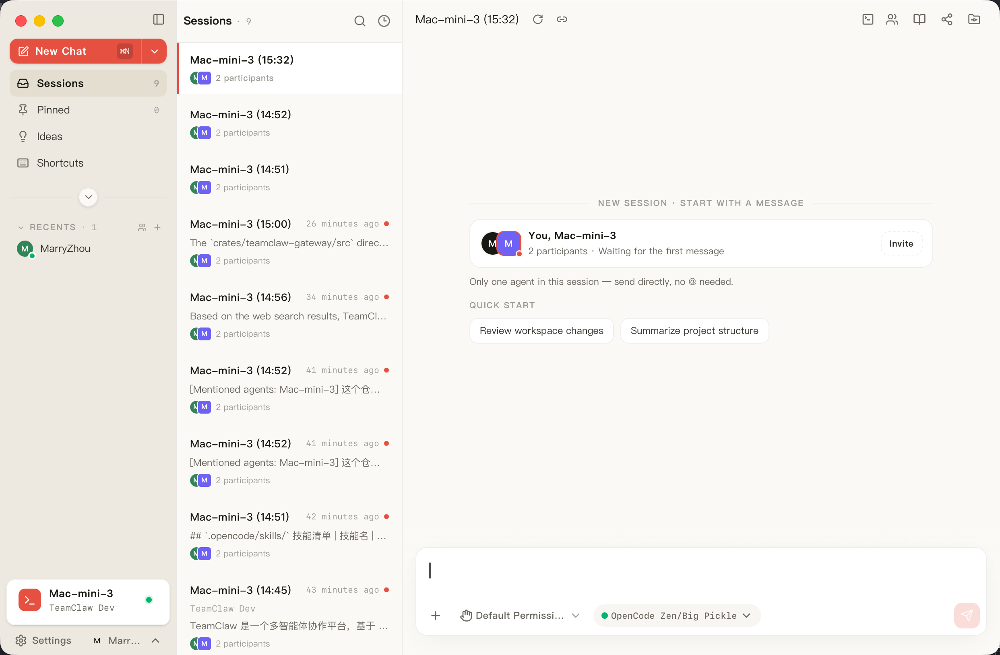
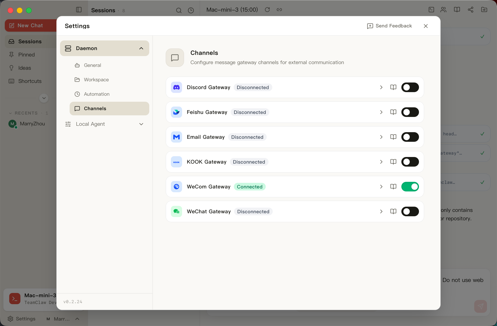

# TeamClaw

[](https://opensource.org/licenses/MIT)
[](https://github.com/different-ai-studio/teamclaw/actions)
[](https://github.com/different-ai-studio/teamclaw/graphs/contributors)

ローカル AI エージェント — あらゆる職務のための AI パートナー

> **あなたの味方。ともに。**

- **👥 チーム向け設計** — Skills・ナレッジ・MCP 設定を Git または S3/OSS 同期でチーム全体に共有しつつ、メンバーごとのプライベートなコンテキストも維持
- **🎭 Skills × ロール** — 合成可能なロールライブラリにより、同じエージェントを営業・サポート・運用・エンジニアリングなど、チームに必要な職務へ特化させられます
- **🔋 標準搭載** — RAG ナレッジベース、Auto UI 理解、音声認識、6 つのチャンネルゲートウェイ（WeCom / Feishu / Discord / Kook / WeChat / Email）を内蔵。糊付けコードは不要です
- **🧑‍💻 個人開発者から中小企業まで** — ローカル優先、デフォルトで非公開。一人での利用から小規模企業までスケールします

[English](README.md) | [简体中文](README.zh-CN.md) | [繁體中文](README.zh-TW.md) | 日本語 | [한국어](README.ko.md)

## スクリーンショット

| ホーム | チャンネル |
|---|---|
|  |  |

## 主な機能

- **3 カラムのワークスペース** — サイドバー、チャット、詳細パネル
- **ローカルエージェントランタイム** — エージェントは自分のマシン上で動作し、`amuxd` デーモンが ACP プロトコルでホストします
- **チャンネルゲートウェイ** — Discord、Feishu、Email、Kook、WeCom、WeChat からエージェントにアクセス
- **自動化** — cron によるスケジュールタスク
- **チーム協力** — OSS または Git 経由でワークスペースを共有。[チーム協力](#チーム協力)を参照
- **MCP サポート** — Model Context Protocol でエージェントをエンタープライズシステムに接続
- **Skills / プラグイン** — ワークスペースレベルおよびグローバルなスキルソースでエージェントを拡張
- **ナレッジベース** — 全文検索と埋め込みベースのインデックス作成・検索
- **内蔵エディター** — Markdown / HTML（Tiptap）、コード（CodeMirror 6）、エージェントファーストの Diff レビューア
- **ローカルファイル操作** — 操作単位の権限管理付き

## 仕組み

TeamClaw はクライアント層、エージェントホスト、クラウドバックエンドに分かれています：

```
  Desktop (Tauri)     iOS      Mobile (Expo)     Chrome extension
        │              │            │                  │
        └──────────────┴─────┬──────┴──────────────────┘
                             │
              ┌──────────────┴───────────────┐
              │      TeamClaw Cloud API      │   identity, teams,
              │            (/v1)             │   sessions, messages
              └──────────────┬───────────────┘
                             │
                    ┌────────┴────────┐
                    │   amux daemon   │  agent host + channel gateways
                    │    (amuxd)      │  + team sync (git / OSS)
                    └────┬───────┬────┘
                         │ ACP   │ ACP
                    ┌────┴──┐ ┌──┴────┐
                    │opencode│ │ codex │  …
                    └────────┘ └───────┘
```

- **クライアント** は UI とローカルファイルを担当します。TeamClaw Desktop をインストールすると `amuxd` デーモンも同時にインストールされるため、そのマシンは最初からエージェントホストになります。
- **amuxd** は ACP 経由でエージェントプロセスをホストし、チャンネルゲートウェイを実行し、チーム同期を担当します。GUI なしでサーバー上に単体インストールすることもできます。
- **Cloud API**（`/v1`）はクライアントが通信する唯一のバックエンドです。契約は [`docs/openapi/teamclaw-api.v1.yaml`](docs/openapi/teamclaw-api.v1.yaml)、アーキテクチャ全体は [`docs/architecture/v2.md`](docs/architecture/v2.md) を参照してください。

## クライアント

| クライアント | パス | ステータス |
|---|---|---|
| **Desktop**（macOS / Windows / Linux） | `apps/desktop/` + `packages/app/` | 主要クライアント |
| **iOS** | `apps/ios/` | ネイティブ SwiftUI、TestFlight で配信 |
| **Mobile**（iOS / Android） | `apps/expo/` | Expo；オンボーディングとセッション |
| **Chrome 拡張機能** | `apps/extension/` | MV3 |

## インストール

[GitHub Releases](https://github.com/different-ai-studio/teamclaw/releases) からプラットフォームに対応したインストーラーをダウンロードしてください — macOS は `.dmg`、Windows は `.exe` です。

### macOS で「壊れている」と表示される場合

macOS がアプリを **「壊れている」** または **「開発元を確認できないため開けません」** と表示する場合、それは未署名のダウンロードに対する Gatekeeper の反応です。次のコマンドで隔離属性を解除してください：

```bash
xattr -cr /Applications/TeamClaw.app
```

Apple Developer 証明書で署名・公証されたビルドでは、この手順は不要です。

## クイックスタート（開発）

**必要条件:** Node.js >= 20、pnpm >= 10、Rust >= 1.70

```bash
pnpm install
pnpm tauri:dev
```

起動後、TeamClaw の画面でワークスペースディレクトリを選択してください。

開発中に初回起動ウィザードをスキップするには：

```bash
pnpm tauri:dev -- --skip-setup --skip-daemon-onboarding
```

フロントエンドのみを起動する場合（Rust ビルドなし）は `pnpm dev` を実行します。ビルドコマンド、共有 Rust ビルドキャッシュ、テストスイート、リポジトリ構成については [コントリビューションガイド](CONTRIBUTING.md) を参照してください。

## チーム協力

チームは 3 つの **共有モード** のいずれかでワークスペースを共有します。モードはチームのオンボーディング時に一度だけ選択され、その後サーバー側でロックされます：

| モード | 内容 |
|---|---|
| `oss` | S3 互換オブジェクトストレージ（Alibaba OSS / WebDAV）経由で同期 |
| `managed_git` | 自動的にプロビジョニングされた Git リポジトリ経由で同期 |
| `custom_git` | 自分でホストする Git リポジトリ経由で同期 |

同期は `amuxd` デーモンが担当し、Git および OSS エンジンを実行します。

### 共有される内容

同期されるのは共有層のみで、ホワイトリスト方式の `.gitignore` によりそれ以外はすべてローカルに保持されます：

- `skills/` — 共有エージェントスキル
- `.mcp/` — MCP サーバー設定
- `knowledge/` — チームナレッジベースのドキュメント

個人ファイルとワークスペース設定が同期されることはありません。

### 注意事項

- Git モードでは有効な Git 認証（SSH キーまたは HTTPS トークン）が必要です。
- 共有ファイルはリモートに追従し、ローカルでの変更は同期時に上書きされます。
- 同期はアプリ起動時に実行され、**Settings → Team** から手動でトリガーすることもできます。

## 設定

ビルド時の設定はリポジトリルートの `build.config.*.json` にあり、次の順序でマージされます：

```
build.config.json → build.config.${BUILD_ENV}.json → build.config.local.json
```

サンプルをコピーして始めてください：

```bash
cp build.config.example.json build.config.local.json
```

最も重要な設定は `cloudApiUrl` で、アプリが接続する TeamClaw Cloud API のデプロイ先を指定します：

```json
{
  "cloudApiUrl": "https://api.teamclaw-dev.ucar.cc",
  "features": {
    "channels": { "discord": true, "feishu": true, "email": true }
  }
}
```

`build.config.local.json` は git 管理外です。ローカル開発では `packages/app/.env.local` の `VITE_CLOUD_API_URL` でエンドポイントを上書きすることもできます。変更を反映するには再ビルドしてください。

Cloud API の実装は `services/fc/`（Node.js 20）にあり、Supabase をバックエンドとし、オプションで共有 AI 予算管理のための LiteLLM プロキシを利用します。

## ドキュメント

- [アーキテクチャ](docs/architecture/v2.md) — コンポーネント、トポロジー、データモデル
- [API 契約](docs/openapi/teamclaw-api.v1.yaml) — TeamClaw Cloud API `/v1`
- [コンテキストマップ](CONTEXT-MAP.md) — リポジトリの境界づけられたコンテキストへの分割
- [コントリビューション](CONTRIBUTING.md) — 開発環境のセットアップ、テスト、リポジトリ構成
- [セキュリティポリシー](SECURITY.md)

## コントリビューション

コントリビューションを歓迎します！詳しくは [コントリビューションガイド](CONTRIBUTING.md) を参照してください。

- 📝 [ドキュメント・翻訳](CONTRIBUTING.md#-documentation--translation-easiest) — 開発環境は不要
- 🐛 [バグ報告](CONTRIBUTING.md#-bug-reports)
- ✨ [機能提案](CONTRIBUTING.md#-feature-suggestions)
- 🔧 [フロントエンド開発](CONTRIBUTING.md#-frontend-development)
- ⚙️ [Rust 開発](CONTRIBUTING.md#-rust-development)

## 技術スタック

- **デスクトップ**: Tauri 2.0 (Rust)
- **デーモン**: Rust (`amuxd`)、Zed エージェントプロトコル上の ACP
- **フロントエンド**: React 19 + TypeScript、Tailwind CSS 4、Zustand
- **iOS**: SwiftUI + SwiftPM (`AMUXCore`)
- **エディター**: Tiptap（Markdown / HTML）、CodeMirror 6（コード）、Shiki（ハイライト）
- **検索**: Tantivy 全文検索 + 埋め込み

## License

MIT
