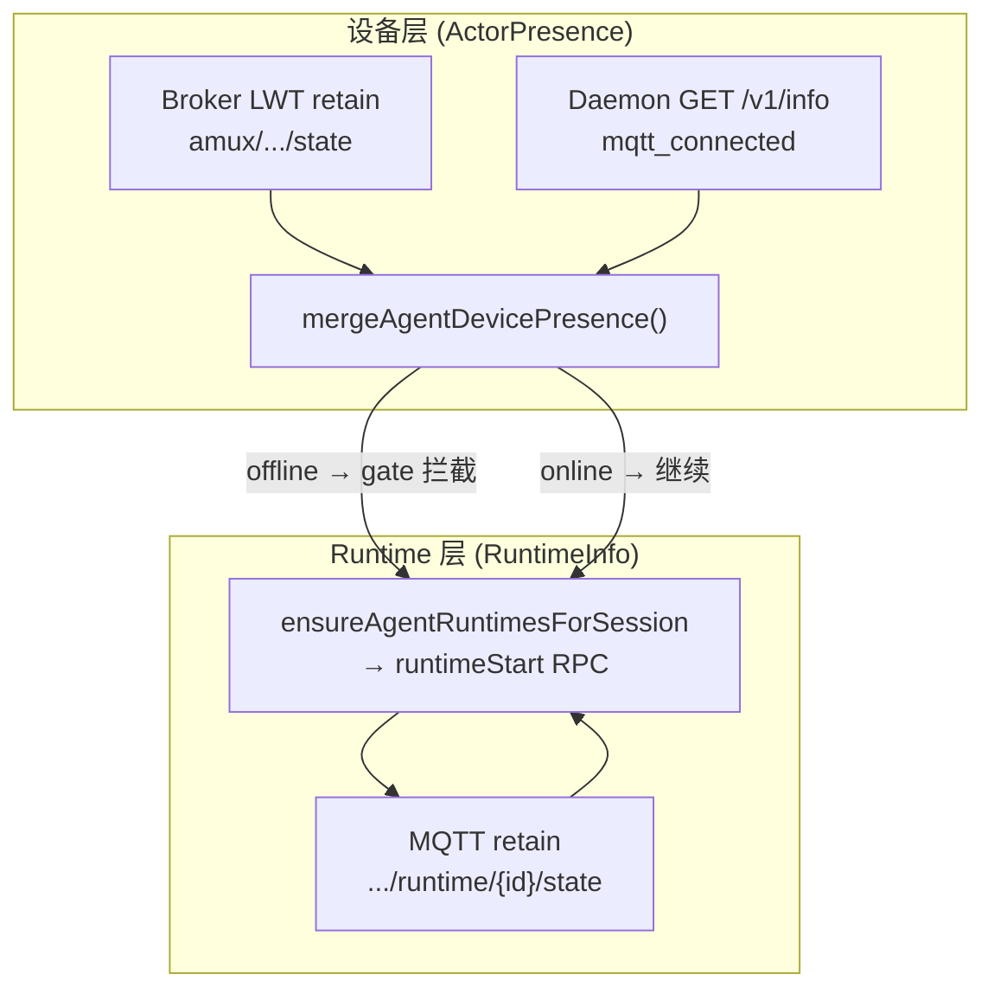

# Agent 设备可达性 & Runtime Ensure 流程

**维护者文档** — 说明桌面客户端如何判断「agent 的 daemon 是否在线」，以及何时 / 为何触发 `runtimeStart`。

**相关修复：** stale MQTT LWT offline retain 导致误报 `device_offline` toast（`Agent runtime not started`）。

**最后更新：** 2026-07-21

---

## 1. 一句话结论

**「agent 设备是否在线」与「会话 ACP runtime 是否已启动」是两层信号。**  
设备层由 `agent-device-reachability.ts` 统一 merge；runtime 层由 `runtime-state-store` + `ensureAgentRuntimesForSession` 负责。  
**本机 daemon 的 `/v1/info.mqtt_connected` 优先于 MQTT broker 上的 LWT retain**，避免 daemon 实际在跑却被 gate 成 offline。

---

## 2. 两层信号（不要混用）

| 层 | MQTT topic | Store | 含义 |
|----|------------|-------|------|
| **设备 / Daemon 在线** | `amux/{team}/{actor}/state` | `useActorPresenceStore` | 该 actor 的 amuxd 进程是否与 broker 保持连接（含 LWT） |
| **会话 Runtime 状态** | `amux/{team}/{actor}/runtime/{id}/state` | `useRuntimeStateStore` | 某次 ACP spawn 的生命周期（ACTIVE / IDLE / …）及 `availableModels` |

典型误踩坑：

- **Runtime retain 仍在 ACTIVE**，但 daemon 已死 → 设备层 offline，runtime retain 可能滞后。
- **设备层 MQTT retain 仍是 offline**（stale LWT），但 daemon 已重连且 `/v1/info.mqtt_connected=true` → 修复前会误 toast；修复后 merge 为 online。



---

## 3. 设备可达性 — 单一 merge 规则

**源文件：** `packages/app/src/lib/agent-device-reachability.ts`

### 3.1 输入

| 字段 | 来源 |
|------|------|
| `mqttOnline` | `useActorPresenceStore.byActorId[agentId].online` |
| `isLocalDaemon` | `getKnownLocalDaemonActorId() === agentId` |
| `daemonMqttConnected` | `GET /v1/info` → `mqtt_connected`（仅本机 daemon） |
| `localHttpOk` | `probeDaemonHttp()` → healthz + token exchange |

### 3.2 `mergeAgentDevicePresence()` 优先级

**本机 daemon（`isLocalDaemon === true`）：**

1. `daemonMqttConnected === true` → **`online`**（覆盖 stale offline **和** ghost online retain）
2. `daemonMqttConnected === false` → **`offline`**
3. 否则看 MQTT retain：
   - `mqttOnline === true` → online
   - `mqttOnline === false` + `localHttpOk === true` → **`unknown`**（HTTP 通但 daemon mqtt 未知）
   - `mqttOnline === false` + `localHttpOk === false` → offline
   - retain 缺失 + `localHttpOk === true` → online（bootstrap）

**远端 agent：**

- MQTT online → online
- MQTT offline → offline
- retain 缺失 → unknown（**never 直接当 offline**）

### 3.3 Sync vs Async

| API | 用途 | 数据源 |
|-----|------|--------|
| `resolveAgentDevicePresenceSync()` | Sidebar、Actor 列表、pill 过滤、绿点 | MQTT store + **5s TTL cache** |
| `resolveAgentDevicePresence()` | `runtimeStart` 前的 **gate** | 必要时拉 `/v1/info`，写入 cache |

**Cache：** `noteLocalDaemonSignals()` / `LOCAL_DAEMON_SIGNAL_CACHE_TTL_MS = 5000`。  
由 `use-local-daemon-http-status`、`resolveLocalDaemonSignals()` 预热。

> **维护注意：** daemon 刚 stop 的 ~5s 内，cache 里可能仍是 `daemonMqttConnected: true`，UI/gate 会短暂显示 online。cache 过期后会正确变为 offline。这是设计 trade-off，不是 stale LWT bug。

### 3.4 本机 actor 身份

**源文件：** `packages/app/src/lib/local-daemon-identity.ts`

- `noteLocalDaemonActorId(id)` — 从 `/v1/info` 或 sidebar 写入，持久化到 `localStorage`（`{appShortName}-local-daemon-actor-id`）
- `getKnownLocalDaemonActorId()` — sync merge 判断「是否本机 agent」

---

## 4. Runtime Ensure 主流程

**源文件：** `packages/app/src/lib/teamclaw/ensure-agent-runtime.ts`

### 4.1 调用链

```
ensureAgentRuntimesForSession(args)
  ├─ shouldSkipAlreadyReadyRuntimeEnsure? → return（wake 路径跳过）
  ├─ inFlight dedupe（同 session + agents）
  ├─ Desktop MQTT disconnected? → toast transport_offline
  ├─ ensureSessionLiveSubscribed
  ├─ waitForTeamclawRpcReady(20s)
  ├─ gateAgentsForRuntimeStart
  │     └─ resolveAgentDevicePresence() per agent
  │           offline → failure code device_offline（toast）
  ├─ ensureAgentIsSessionParticipant
  ├─ resolveSessionWorkspaceHintForRuntimeStart
  ├─ startAgentRuntimesAsync（MQTT runtimeStart RPC）
  └─ 等 runtime retain 出现 models（最多 12s）
```

### 4.2 Gate 失败码

| code | 含义 | 常见原因 |
|------|------|----------|
| `device_offline` | merge 结果为 offline | 真 offline、或修复前的 stale LWT |
| `transport_offline` | Desktop MQTT 断 | `useMqttReconnectStore.connected === false` |
| `runtime_rejected` / `runtime_rpc_failed` | RPC 层失败 | daemon busy、workspace 问题 |
| `workspace_*` | workspace ensure 超时 / 失败 | 团队 share 未就绪 |

Toast 文案：`daemon.agentRuntime.notStartedTitle` + `failureDescription()`。

### 4.3 超时常量

**源文件：** `packages/app/src/lib/teamclaw/runtime-rpc-timeouts.ts`

- `DEVICE_PRESENCE_GATE_TIMEOUT_MS = 2000` — gate 等 MQTT retain
- `RUNTIME_START_RPC_TIMEOUT_MS = 20000` — runtimeStart RPC

---

## 5. Runtime Ensure 调度 — 何时 skip

**源文件：** `packages/app/src/lib/teamclaw/runtime-ensure-scheduler.ts`

### 5.1 Reason 分类

**Wake 路径（可 skip 已 ready runtime）：**

| reason | 触发方 |
|--------|--------|
| `session_focus` | 切换会话 |
| `session_runtime_wake` | 同会话 pill 变 connecting |
| `session_runtime_retry` | 15s 定时重试 |
| `mqtt_reconnect_ensure` | Desktop MQTT 重连 |
| `session_auto_engage` | 打开 sole-agent 会话自动 engage |

**Bind 路径（永不 skip，必须能绑新会话）：**

| reason | 触发方 |
|--------|--------|
| `session_create` | 新建会话（非 auto-mention 的 agent） |
| `outbox_send` | 发消息 / outbox |
| `mention_pill` | @ agent pill |
| `offline_banner_retry` | 用户点 offline banner 重试 |

`shouldSkipAlreadyReadyRuntimeEnsure()`：wake reason **且** 所有 agent 的 MQTT retain 已是 `ACTIVE` + 有 `availableModels` → 跳过 `runtimeStart`。

**Throttle：** 同 `sessionId + agentIds` 3s 内不重复 ensure（`RUNTIME_ENSURE_MIN_INTERVAL_MS`）。

### 5.2 新建 sole-agent 会话的去重

**源文件：** `packages/app/src/components/chat/ChatPanel.tsx`

 sole member + sole agent 创建会话时会 **auto-mention** → `outbox_send` 已 ensure。  
 此时打日志 `session_create.runtime_start.delegated_to_outbox`，**不再**发 `session_create` ensure，避免重复 RPC。

---

## 6. UI 消费方（统一走 merge）

| 表面 | 文件 | API |
|------|------|-----|
| Sidebar Actor 行 | `ActorRow.tsx`, `ActorsView.tsx` | `resolveActorOnlineStatus()` → sync merge |
| @ 提及弹层 | `MentionPopover.tsx` | 同上 |
| 会话参与者绿点 | `SessionActorSheet.tsx` | sync merge |
| Agent pill 状态 | `use-engaged-agent-ui-states.ts` | merge + runtime retain |
| 本机 daemon 卡片 | `use-local-daemon-http-status.ts` | `mergeAgentDevicePresence` + probe |
| Actor 目录在线 | `lib/actor-online.ts` | agent 走 sync merge；member 走 `last_active_at` |

**原则：** 不要再直接读 `useActorPresenceStore.byActorId[id].online` 当最终 UI 结论（本机 agent 除外需 merge）。

---

## 7. Session focus 唤醒逻辑

**源文件：** `packages/app/src/hooks/use-ensure-engaged-runtimes-on-session-focus.ts`

- **切换会话：** `session_focus` → `agentIdsNeedingRecoverableRuntimeWake`
  - 含 `connecting`
  - 含 `offline` **但** `resolveAgentDevicePresenceSync !== 'offline'`（排除 hard offline）
- **同会话内：** 只对 **新变 connecting** 的 agent 发 `session_runtime_wake`（不对 offline 反复 wake）
- **15s 定时：** `session_runtime_retry`，条件同 recoverable wake

MQTT 重连：**`use-reensure-runtimes-on-mqtt-reconnect.ts`** → `mqtt_reconnect_ensure`。

---

## 8. 调试手册

### 8.1 日志

| 渠道 | 过滤 / 操作 |
|------|-------------|
| Console | `[session-flow]` — 创建会话、ensure、delegated_to_outbox、skip_already_ready |
| Settings → General | **ACP stream debug** — `client:runtime_start_failed`, `client:ensure_runtime_begin` |
| Console | `window.__teamclawMqttDiag()` — Desktop MQTT、team、presence store 快照 |

### 8.2 本机 daemon

```bash
curl -s -H "Authorization: Bearer $(cat ~/.amuxd/amuxd.http.token)" \
  "http://127.0.0.1:$(cat ~/.amuxd/amuxd.http.port)/v1/info" | python3 -m json.tool
```

关注：`actor_id`、`mqtt_connected`。

### 8.3 开发态 App 内注入（tauri-mcp）

`execute_js` **不会 await Promise**。需用「写入 `window.__tcTest` + 轮询」模式，或跑仓库内 live 脚本（见 §9）。

### 8.4 常见问题排查

| 现象 | 先查 |
|------|------|
| `device_offline` toast | `/v1/info.mqtt_connected` vs presence store raw；是否本机 agent |
| `transport_offline` toast | Desktop MQTT（`__teamclawMqttDiag`），不是 daemon |
| pill 长期 connecting | runtime retain 是否有 models；ensure 是否被 skip/throttle |
| Sidebar 与 pill 状态不一致 | 是否有人绕开 merge 直读 presence store |
| daemon 停后仍显示 online ~5s | signal cache TTL，见 §3.3 |

---

## 9. 测试

### 9.1 单元测试

```bash
cd packages/app && pnpm exec vitest run \
  src/lib/__tests__/agent-device-reachability.test.ts \
  src/lib/teamclaw/__tests__/ensure-agent-runtime-presence.test.ts \
  src/lib/teamclaw/__tests__/runtime-ensure-scheduler.test.ts \
  src/hooks/__tests__/use-ensure-engaged-runtimes-on-session-focus.test.ts \
  src/lib/__tests__/actor-online.test.ts
```

### 9.2 功能 E2E（tauri-mcp）

需 `pnpm tauri:dev` 运行且 `/tmp/tauri-mcp.sock` 存在：

```bash
pnpm exec vitest run --config vitest.config.e2e.ts \
  tests/functional/chat-session-send.test.ts
```

### 9.3 Live 验证脚本（维护者本地）

在 dev App 运行时，可用 tauri-mcp 注入 stale offline 并断言 merge（脚本示例曾放于 `/tmp/teamclaw-reachability-live.mts`）。  
核心断言：

- inject `mqttOnline=false` + `daemonMqttConnected=true` → `async === 'online'`
- amuxd stop + cache 过期 → `async === 'offline'`
- amuxd restart + stale offline retain → `async === 'online'`

**注意：** `scripts/amuxdctl.sh start` 会触发 cargo build，较慢；快速停启可用：

```bash
.cargo-target/debug/amuxd stop
.cargo-target/debug/amuxd start --daemonize
```

---

## 10. 相关文件索引

| 职责 | 路径 |
|------|------|
| Merge 规则 + sync/async resolve | `packages/app/src/lib/agent-device-reachability.ts` |
| 本机 actor id | `packages/app/src/lib/local-daemon-identity.ts` |
| MQTT presence store | `packages/app/src/stores/actor-presence-store.ts` |
| Runtime retain store | `packages/app/src/stores/runtime-state-store.ts` |
| Ensure 入口 | `packages/app/src/lib/teamclaw/ensure-agent-runtime.ts` |
| Skip / throttle | `packages/app/src/lib/teamclaw/runtime-ensure-scheduler.ts` |
| Focus / retry hooks | `packages/app/src/hooks/use-ensure-engaged-runtimes-on-session-focus.ts` |
| MQTT 重连 ensure | `packages/app/src/hooks/use-reensure-runtimes-on-mqtt-reconnect.ts` |
| Outbox send ensure | `packages/app/src/services/outbox-sender.ts` |
| Actor 在线（目录） | `packages/app/src/lib/actor-online.ts` |
| Daemon HTTP / sidebar status | `packages/app/src/hooks/use-local-daemon-http-status.ts` |
| runtimeStart RPC | `packages/app/src/lib/session-create.ts` |

---

## 11. 修改指南（给后续开发者）

1. **新增「agent 是否在线」UI** → 用 `resolveAgentDevicePresenceSync` 或 `resolveActorOnlineStatus`，不要直读 MQTT store。
2. **新增 ensure 调用点** → 选对 `reason`：绑新会话用 bind reason；切 tab / 重连用 wake reason。
3. **改 merge 规则** → 同时更新 `agent-device-reachability.test.ts` 与 `ensure-agent-runtime-presence.test.ts`。
4. **改 skip 逻辑** → 更新 `runtime-ensure-scheduler.test.ts` 与 focus hook 测试。
5. **不要**把 Desktop MQTT 断连与 daemon device offline 混为一谈 — gate 里两者分开处理。

---

## 12. 延伸阅读

- Daemon 侧 agent 发现 / advertise：`docs/architecture/agent-backend-discovery-and-advertise.md`
- Runtime 与 interrupt 陈旧 spawn：`docs/debug/interrupt-agent-stale-runtime.md`
- tauri-mcp 测试：`apps/desktop/tauri-plugin-mcp-local/README.md`
