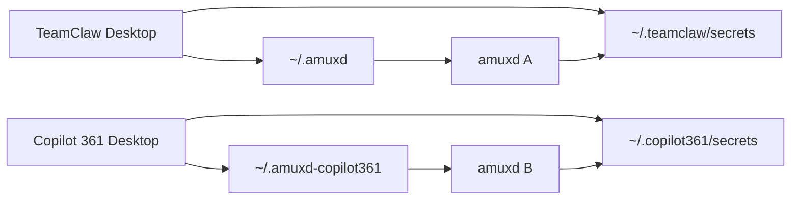

# 本机多品牌隔离（轻量方案）

> 状态：P0 已落地（2026-08）——`AMUXD_HOME` / `TEAMCLAW_BRAND_SHORT_NAME` 推导
> `~/.amuxd` vs `~/.amuxd-<brand>`。原则：**只拆本机状态目录 + 复用已有 brand env**，
> 不做跨品牌路由、不做云端 personal 同步。P1 workspace meta 品牌化见
> [`multi-brand-workspace-meta-p1.md`](./multi-brand-workspace-meta-p1.md)。

相关：[`personal-env-and-runtime-env.md`](./personal-env-and-runtime-env.md)。

---

## 1. 问题

同机安装 TeamClaw 与 Copilot 361（或其它白标）时：

| 资源 | 今日 | 后果 |
|---|---|---|
| `~/.amuxd` | **全局一份** | 身份 / port / sock / team-secrets 串台；后开的 Desktop heal 掉先开的 amuxd |
| `~/.{brand}/secrets` | Desktop 已按 brand；daemon 靠 `TEAMCLAW_BRAND_SHORT_NAME` | 未设 env 时白标误读 `~/.teamclaw` |
| Workspace `.teamclaw` vs `.{brand}` | Desktop 已分流；daemon 大量写死 `.teamclaw` | 纯白标 workspace 上 skills/配置可能扫不到 |

Desktop app data、bundle id 已经按 brand 隔离——缺口几乎都在 **daemon 状态目录** 与 **workspace 元数据路径**。

---

## 2. 目标 / 非目标

**要：**

- 两品牌本机状态互不覆盖
- Personal secrets 与 daemon 注入同 brand
- Heal / stop 只影响本 brand 的 amuxd
- 官方路径保持 `~/.amuxd`（零迁移）

**不要（第一阶段）：**

- 远程 daemon 多品牌方案
- 云端 personal blob
- 「一个 Desktop 配置另一个 brand 的 daemon」
- 自动把旧 `~/.amuxd` 拷进白标目录（易静默串身份）
- 一次 PR 清掉 daemon 全部 `.teamclaw` 字面量

---

## 3. 核心：品牌化 amuxd 状态目录

### 3.1 规则

```text
official (teamclaw | teamclawdev) → ~/.amuxd
white-label (copilot361, …)       → ~/.amuxd-<brand>   # 例 ~/.amuxd-copilot361
```

解析顺序：

1. `AMUXD_HOME` 已设置 → 使用该路径（测试 / 运维覆盖）
2. 否则读 `TEAMCLAW_BRAND_SHORT_NAME`（缺省 `teamclaw`），按上表推导

实现落点：单一 helper（建议放 `teamclaw-runtime-env`，与 `brand_short_name_from_env` 并列），供：

- `DaemonConfig::config_dir()`
- Desktop：`amuxd_supervisor` / `daemon_http` / `daemon_live` / `team_sync_proxy` / diagnostics 的 `amuxd_dir()`

Spawn 时：继续设 `TEAMCLAW_BRAND_SHORT_NAME`；可选再设 `AMUXD_HOME`（排障更直观，非必须）。

### 3.2 结果



- 两套 `amuxd.http.port` / token / `daemon.toml` / `team-secrets/`
- 可同时健康运行
- Heal 只读本 brand 目录下的 pid，不误杀另一品牌

### 3.3 迁移策略（刻意轻）

| Brand | 行为 |
|---|---|
| Official | 路径不变，无迁移 |
| White-label | 使用新空目录；用户重新 onboard（或手动复制——不自动） |

不自动从 `~/.amuxd` 拷到 `~/.amuxd-copilot361`：避免把 TeamClaw 的 cloud token / actor 静默变成 Copilot 身份。

LaunchAgent（`cc.ucar.amuxd`）维持现有 legacy migrate；白标继续 **managed spawn**，不注册全局 launchd。

---

## 4. 第二刀（仍轻）：workspace 元数据跟 brand

在 `storage_namespace`（或同等模块）暴露与 Desktop `build.rs` 一致的：

```text
workspace_meta_dir(brand)    → ".teamclaw" | ".{brand}"
workspace_config_file(brand) → "teamclaw.json" | "{brand}.json"
```

Daemon 内 **先替换关键路径**（skills/roles、team 配置读取、refresh watch、git team section、`opencode.runtime.json` 旁路），其余硬编码分批清。

Personal secrets **不依赖**这一步；纯 `.{brand}` workspace 的 skills/配置依赖这一步。

---

## 5. 落地顺序

1. **P0** — `config_dir` + Desktop discovery 品牌化；双 brand 双 port 测试  
2. **P0** — 安装包确认带上 `TEAMCLAW_BRAND_SHORT_NAME`（源码已有）  
3. **P1** — workspace meta helper + 关键路径  
4. **文档** — 与 personal-env 文档交叉链接

### 验收

- 同机 TeamClaw + Copilot 361 各有 amuxd、各有 healthz  
- Copilot 退出不影响 TeamClaw 的 amuxd（反之亦然）  
- Copilot 个人变量路径与 daemon 诊断一致（`~/.copilot361/secrets`）  
- Official 仍使用 `~/.amuxd`

---

## 6. 一句话

**轻量隔离 = 白标用 `~/.amuxd-<brand>`，官方保留 `~/.amuxd`；secrets 继续用 `TEAMCLAW_BRAND_SHORT_NAME`；workspace 元数据用同一 brand 解析做薄封装。不搞自动迁身份、不做跨品牌管理面。**
