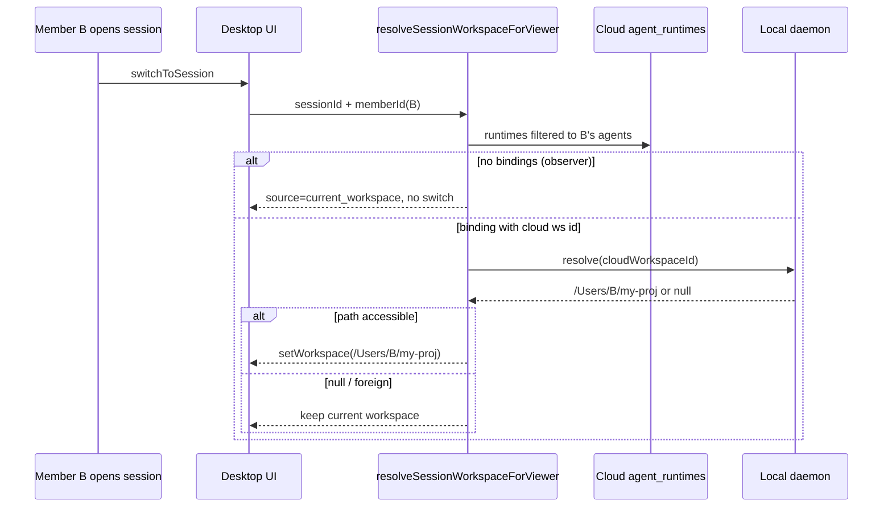

# Session Viewer-Scoped Workspace Design

**Date:** 2026-06-18  
**Status:** Approved (product decision locked)  
**Problem:** Opening a multi-participant session auto-switches desktop workspace to another member's filesystem path, causing knowledge/RAG/file-watcher failures.

---

## Summary

Sessions are team-shared; workspaces are **machine-local and member/agent-scoped**. The desktop must never adopt another member's absolute path when opening a session. Workspace resolution on session open becomes **viewer-scoped**: only runtimes belonging to the current member's agents (especially the local daemon agent) may influence UI workspace selection.

**Product decision (locked):** When the viewer has **no agent** in the session (pure observer), **do not switch workspace** (Option A). Chat uses Cloud API; knowledge/files stay on the viewer's current workspace.

---

## Background / Current Behavior

### What works today (keep)

| Layer | Model |
|-------|--------|
| Cloud | `agent_runtimes(session_id, agent_id, workspace_id)` — per-agent-per-session |
| Runtime start | `resolveAgentRuntimeWorkspaceId` — session-scoped hints, no cross-session leak |
| Daemon | Cloud UUID → local path via `workspaces.toml` (`remote_workspace_id`) |

### What is broken (fix)

| Layer | Problem |
|-------|---------|
| Desktop `session_workspace` | PK = `session_id` (1:1); last runtime overwrites others |
| `switchToSessionWorkspaceIfNeeded` | Uses cloud `workspaces.path` directly via `setWorkspace(foreignPath)` |
| No validation | Foreign `/Users/<other>/...` paths adopted without existence/write checks |

### Symptom

Opening a group session created by another member triggers:

- `Failed to start file watcher`
- `Failed to load knowledge files`
- `Failed to save configuration`

Chat still works; errors are side effects of invalid local workspace adoption.

---

## Design Principles

1. **Viewer-scoped** — Workspace on session open = f(session, currentMember, localMachine), not f(session) globally.
2. **Never foreign path** — Never `setWorkspace` with another member's absolute path.
3. **Chat ≠ Workspace** — Messages/participants are cloud-only; local workspace serves files, knowledge, team config, and local agent runtime context.
4. **Multi-agent explicit** — A session may have N agent×workspace pairs; UI shows only bindings relevant to the viewer.
5. **Graceful fallback** — Resolution failure → keep current workspace; no error toast for watcher/knowledge on failed adoption.

---

## Core Model: Session View Context

Ephemeral UI/local concept (not a new cloud table):

```typescript
type SessionViewContext = {
  sessionId: string
  viewerMemberId: string
  viewerLocalDaemonAgentId: string | null

  myAgentBindings: Array<{
    agentId: string
    cloudWorkspaceId: string
    localPath: string | null // null = cloud id not registered on this daemon
  }>

  resolved: {
    cloudWorkspaceId: string | null
    localPath: string | null
    source:
      | 'my_runtime_in_session'
      | 'my_agent_default'
      | 'current_workspace' // observer / no resolvable binding
      | 'none'
  }
}
```

### "My agent" definition

An agent is **mine** for workspace resolution if any of:

1. It is the **local daemon agent** for this team on this machine.
2. `workspaces.created_by_member_id === viewerMemberId` (or equivalent actor→member mapping).
3. Agent is in the viewer's **default / pinned** agent set (member preferences), when participating in this session.

**Exclude** all other members' agents and their `workspaces.path` values.

---

## Resolution Algorithm

`resolveSessionWorkspaceForViewer(teamId, sessionId, viewer)`:

```
1. Load agent_runtimes for sessionId (cloud or local cache).
2. Filter to myAgentBindings only.
3. For each binding, resolve localPath = daemon.resolve(cloudWorkspaceId).

4. If myAgentBindings is empty:
   → resolved.source = 'current_workspace'
   → DO NOT call setWorkspace (Option A — observer)

5. Else if local daemon agent has a binding with accessible localPath:
   → use that binding (highest priority)

6. Else if exactly one binding with accessible localPath:
   → use that binding

7. Else if multiple accessible bindings:
   → use most recently updated runtime's binding
   → UI may show "multi-workspace" hint (Phase 3)

8. Else if cloudWorkspaceId exists but localPath is null:
   → keep current workspace
   → optional soft prompt: "Register workspace for agent X" (Phase 3)
   → NEVER use cloud workspaces.path from another machine

9. Else:
   → keep current workspace
```

### Path adoption guard (required)

```typescript
function canAdoptWorkspacePath(path: string): boolean {
  // Must exist, be writable, and not be another user's home path heuristic
  return exists(path) && isWritable(path) && !looksLikeForeignHomePath(path)
}
```

`setWorkspace` is only called when `canAdoptWorkspacePath(localPath)` is true.

---

## UI Behavior Matrix

| Scenario | On session open | Knowledge / files | Agent runtime |
|----------|-----------------|-------------------|---------------|
| Pure human group chat (no agents) | No switch | Current workspace | None |
| Observer (no my agents in session) | **No switch (A)** | Current workspace | None |
| My 1 agent @ 1 workspace | Switch if local path OK | That workspace | Existing flow |
| My multiple agents @ different workspaces | Switch to primary (daemon first) | Primary workspace | Per-agent unchanged |
| Others' agents only | No switch | Current workspace | Cloud messages only |

---

## Local Cache Schema Change (Phase 2)

**Current:**

```sql
session_workspace (
  session_id PRIMARY KEY,
  team_id, workspace_id, workspace_path, updated_at
)
```

**Target:**

```sql
session_viewer_workspace (
  session_id,
  viewer_member_id,
  agent_id,              -- which agent's binding
  cloud_workspace_id,
  local_workspace_path,  -- resolved on THIS machine only; never copy foreign path
  updated_at,
  PRIMARY KEY (session_id, viewer_member_id, agent_id)
)
```

**Sync (`syncSessionWorkspaces`):**

- Still sources from cloud `agent_runtimes` + workspace metadata.
- Filter rows to viewer's agents before upsert.
- `local_workspace_path` = daemon registry lookup, **not** cloud `workspaces.path` verbatim.

**Session list label:**

- Basename of viewer's resolved path, or empty for observers.
- Multi-workspace: `proj-a +2` (Phase 3).

---

## What Does NOT Change

- Cloud `sessions` table — no `workspace_id` column.
- Group chat messaging, participants, realtime.
- `agent_runtimes` cloud model.
- `resolveAgentRuntimeWorkspaceId` / `runtimeStart` pipeline.
- iOS per-agent workspace picker (already correct direction).

---

## Implementation Phases

### Phase 1 — Stop the bleeding (priority)

**Goal:** Eliminate foreign-path adoption and error toasts without full schema migration.

| Change | File(s) |
|--------|---------|
| Replace `resolveSessionWorkspacePath` logic with viewer filter + path guard | `packages/app/src/lib/session-by-workspace.ts` |
| Observer / empty bindings → return null, skip `setWorkspace` | `switchToSessionWorkspaceIfNeeded` |
| Resolve path via daemon `listDaemonWorkspaces`, not cloud `workspaces.path` | `session-by-workspace.ts`, `session-workspace-sync.ts` |
| `initForWorkspace` / watcher: no toast on expected skip | `packages/app/src/stores/knowledge.ts` (optional polish) |

**Acceptance:**

- Member B opens session created by Member A → no switch to `/Users/A/...`
- No "Failed to start file watcher" on session open for observer case
- Member B with own agent in session → switches only to B's registered local path

### Phase 2 — Correct data model ✅ (2026-06-18)

| Change | File(s) |
|--------|---------|
| Migrate `session_workspace` → `session_viewer_workspace` | `apps/desktop/src/local_cache/store.rs`, `local-cache.ts` |
| Viewer-scoped sync + load | `session-workspace-sync.ts`, `session-viewer-workspace.ts` |
| Session list filter by viewer workspace | `session-by-workspace.ts`, `SessionListColumn.tsx` (via hooks) |
| Offline cache fallback on session open | `resolveSessionWorkspaceForViewer` |
| Unit tests | `session-*-workspace*.test.ts`, Rust `session_workspace_upsert_and_load_roundtrip` |

### Phase 3 — UX polish (optional)

- Session header: "2 workspaces" when viewer has multiple bindings
- "Register workspace" CTA when cloud id exists but local path missing
- Desktop New Session: per-agent workspace picker (align with iOS)

---

## Sequence (Target State)



---

## Open Questions (Deferred)

- **Multi-workspace picker in chat header** when viewer has 2+ accessible bindings — Phase 3.
- **Team shared git repo** as a virtual workspace root — separate from this spec; viewer-scoped rules still apply to local checkout path.

---

## References

- `packages/app/src/lib/session-by-workspace.ts`
- `packages/app/src/lib/session-workspace-sync.ts`
- `packages/app/src/lib/teamclaw/resolve-runtime-start-workspace.ts`
- `packages/app/src/stores/ui.ts` (`switchToSession`)
- `apps/desktop/src/local_cache/store.rs` (`session_workspace`)
- `docs/architecture/v2.md`
