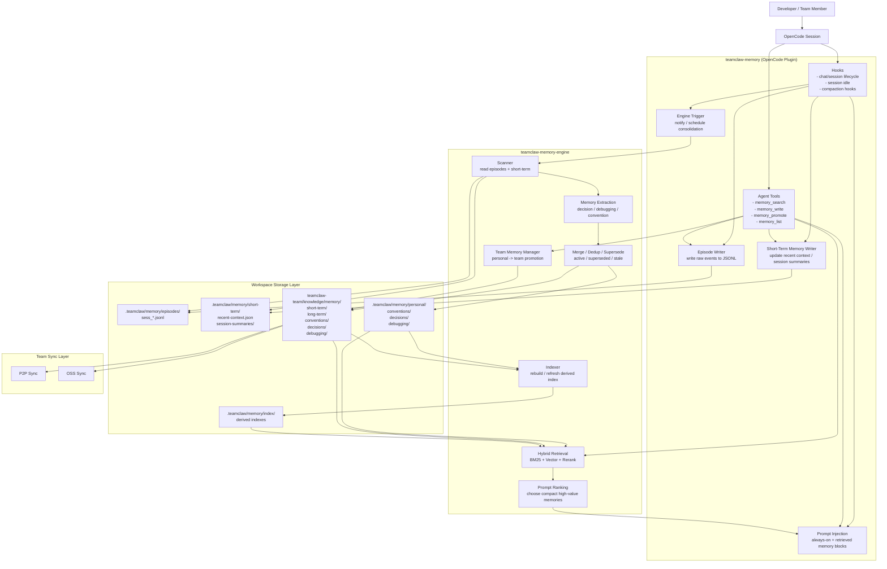

# TeamClaw Memory Plugin Implementation Spec

**Date:** 2026-04-09
**Status:** Draft
**Related Design:** `docs/superpowers/specs/2026-04-09-teamclaw-long-term-memory-design.md`

## Goal

Implement TeamClaw's workspace-scoped long-term memory system using an **OpenCode managed plugin** as the agent-facing layer, while keeping TeamClaw core responsible for storage, retrieval, indexing, and team sync.

This spec defines:

- plugin responsibilities
- backend responsibilities
- API contract between them
- rollout phases
- initial file changes

## Architecture

Use a **two-layer architecture**:

1. **OpenCode plugin layer**
   - injects compact always-on memory into the prompt
   - exposes memory tools to the agent
   - writes file-first episodes and short-term memory
   - triggers consolidation at safe lifecycle points

2. **TeamClaw backend layer**
   - does not own the write path for near-session data
   - owns consolidation, long-term extraction, and retrieval quality
   - indexes memory for retrieval
   - writes consolidated long-term memory to the correct workspace paths
   - manages status, provenance, and supersession

This is a **hybrid route**:

- `write path` → plugin writes workspace files directly
- `search and ranking path` → plugin relies on TeamClaw services
- `source of truth` → workspace files

This keeps the plugin close to OpenCode session behavior while keeping retrieval and consolidation logic centralized.

### Architectural Boundary



## Responsibilities

### OpenCode Plugin

The plugin should be responsible for:

- `always-on` prompt injection
- raw episode capture
- short-term memory maintenance
- custom tools:
  - `memory_search`
  - `memory_write`
  - `memory_promote`
  - `memory_list`
- consolidation triggers on safe hooks such as:
  - session idle
  - optional compaction-related hooks

The plugin should **not**:

- own the source-of-truth file format
- maintain its own vector index or BM25 index
- implement team sync rules
- own long-term dedup/supersede logic
- own high-quality retrieval ranking

### TeamClaw Backend

The backend should be responsible for:

- scanning plugin-written workspace memory files
- consolidating short-term memory into durable records
- search and indexing
- prompt block assembly
- record versioning
- `active / superseded / stale` transitions
- provenance capture
- personal vs team path routing

## Data Layout

### Personal Memory

Source of truth:

```text
<workspace>/.teamclaw/memory/personal/
```

### Team Memory

Source of truth:

```text
<workspace>/teamclaw-team/knowledge/memory/
```

### Raw Episodes

Private consolidation input:

```text
<workspace>/.teamclaw/memory/episodes/
```

### Short-Term Memory

Plugin-maintained near-session context:

```text
<workspace>/.teamclaw/memory/short-term/
```

Suggested contents:

```text
recent-context.json
session-summaries/
```

### Derived Index

Rebuildable artifacts:

```text
<workspace>/.teamclaw/memory/index/
```

## Memory Record Schema

The source-of-truth record format is Markdown with frontmatter.

Minimum fields:

```yaml
id: mem_...
scope: personal | team
kind: decision | debugging | convention
status: active | superseded | stale
confidence: low | medium | high
summary: ...
created_at: 2026-04-09T12:00:00Z
updated_at: 2026-04-09T12:00:00Z
source_refs:
  - type: session
    value: sess_123
```

Recommended fields:

```yaml
tags: [p2p, indexing]
supersedes: mem_old_id
prompt_policy: always | retrieve | never
```

Body:

- short explanation
- decision rationale
- debugging detail
- convention detail

## Plugin Contract

The plugin should only talk to the TeamClaw backend through a narrow local API.

### 1. Always-On Prompt Block

The plugin fetches a compact stable memory block for the current workspace and appends it through `experimental.chat.system.transform`.

Suggested backend endpoint:

```text
POST /api/memory/prompt/always-on
```

Request:

```json
{
  "limit": 8
}
```

Response:

```json
{
  "text": "[Workspace Memory - Always On]\n..."
}
```

Rules:

- include only compact, stable, active memories
- prioritize `convention`
- include only high-confidence decision summaries
- avoid raw debugging logs and raw episodes

### 2. `memory_search`

Used by the agent to retrieve relevant personal/team memory for the current task.

Suggested backend endpoint:

```text
POST /api/memory/search
```

Request:

```json
{
  "query": "why does p2p reconnect duplicate members",
  "scope": "all",
  "kind": ["debugging", "decision"],
  "limit": 5
}
```

Response:

```json
{
  "results": [
    {
      "id": "mem_1",
      "scope": "team",
      "kind": "debugging",
      "status": "active",
      "summary": "Watcher re-entry caused duplicate indexing",
      "content": "Debounce fixes the duplicate pass ...",
      "source_refs": [
        { "type": "session", "value": "sess_123" }
      ]
    }
  ]
}
```

### 3. `memory_write`

Used to persist a new memory record.

Write path:

- plugin writes file-first records directly into the workspace memory layout
- backend does not need to sit in the middle of basic writes
- backend later scans and consolidates those files

Suggested plugin-side output targets:

```text
.teamclaw/memory/episodes/
.teamclaw/memory/short-term/
.teamclaw/memory/personal/
teamclaw-team/knowledge/memory/short-term/
```

Request:

```json
{
  "scope": "personal",
  "kind": "decision",
  "summary": "Use manifest as authoritative member source",
  "details": "Reconnect logic should not let stale local state override manifest state.",
  "confidence": "high",
  "tags": ["p2p", "membership"],
  "prompt_policy": "always",
  "source_refs": [
    { "type": "session", "value": "sess_123" },
    { "type": "file", "value": "src-tauri/src/commands/team_p2p.rs" }
  ]
}
```

Response:

```json
{
  "id": "mem_20260409_manifest_authoritative",
  "scope": "personal",
  "path": ".teamclaw/memory/personal/decisions/mem_20260409_manifest_authoritative.md",
  "written": true
}
```

### 4. `memory_promote`

Used to promote a personal memory into team scope.

Suggested backend endpoint:

```text
POST /api/memory/promote
```

Request:

```json
{
  "id": "mem_20260409_manifest_authoritative",
  "to_scope": "team"
}
```

Behavior:

- plugin or engine reads the personal record
- write a team-scoped record
- preserve provenance
- optionally link back to source memory

### 5. `memory_list`

Used for review and future UI.

Suggested backend endpoint:

```text
POST /api/memory/list
```

Request:

```json
{
  "scope": "team",
  "kind": ["decision"],
  "status": ["active", "superseded"]
}
```

## Plugin Hooks

### Required Hook

Use:

```text
experimental.chat.system.transform
```

Purpose:

- inject compact always-on memory block

Constraints:

- must remain stable and small
- should not dump large retrieval payloads
- should degrade safely if the local API is unavailable

### Deferred Hook

Add consolidation later on safe lifecycle hooks, such as:

- session idle
- compacting-like session lifecycle hooks if available and reliable

Do **not** write memory on every tool call by default.

Preferred flow:

1. gather evidence during the session
2. write episodes and short-term summaries immediately
3. consolidate when the session is idle
4. write at most a few high-value long-term memories

## Backend API Strategy

There is already a local RAG HTTP server on `127.0.0.1:13143`.

Current endpoints include:

- `/api/rag/search`
- `/api/rag/memory/list`
- `/api/rag/memory/save`
- `/api/rag/memory/delete`

The memory plugin implementation should reuse this local server for retrieval and ranking rather than inventing a separate plugin-side search stack.

### New Endpoints to Add

- `POST /api/memory/prompt/always-on`
- `POST /api/memory/search`
- `POST /api/memory/promote`
- `POST /api/memory/list`
- `POST /api/memory/consolidate-session`

### Why a Separate `/api/memory/*` Namespace

Current `/api/rag/memory/*` endpoints are too narrow:

- they only cover simple file save/delete/list
- they assume one memory directory
- they do not model scope, kind, status, provenance, or promotion

The new namespace should become the durable contract for the memory plugin.

## Rollout Plan

### Phase 1: Managed Read-Only Plugin

Deliver:

- managed plugin installer
- `experimental.chat.system.transform`
- `memory_search`
- backend always-on prompt API
- backend search API

No proactive write yet.

Success criteria:

- agent sees compact project memory automatically
- agent can retrieve relevant memory explicitly

### Phase 2: Explicit Write Tools

Deliver:

- `memory_write`
- `memory_list`
- `memory_promote`
- plugin file routing for episodes, short-term, and personal memory
- backend promotion endpoint and consolidation logic
- incremental reindex after consolidation

Success criteria:

- agent can intentionally persist useful workspace memory
- team-promotable memory can be shared through `teamclaw-team/`

### Phase 3: Proactive Consolidation

Deliver:

- evidence buffering
- session-idle consolidation
- backend `consolidate-session`
- first-pass heuristics for:
  - decisions
  - debugging lessons
  - conventions

Success criteria:

- memory grows automatically without becoming noisy

### Phase 4: Review UI

Deliver:

- memory review UI
- filters by scope/kind/status
- edit/delete/stale/supersede actions
- provenance visibility

Success criteria:

- users can inspect and correct memory drift

## Initial File Changes

### New Frontend Files

- `packages/app/src/lib/opencode/memory-plugin-installer.ts`
- `packages/app/src/lib/opencode/templates/teamclaw-memory-plugin.ts.txt`

### Frontend Files to Modify

- `packages/app/src/components/chat/ChatPanel.tsx`
  - ensure the managed memory plugin at startup

### Backend Files to Modify

- `src-tauri/src/commands/rag_http_server.rs`
  - add `/api/memory/*` retrieval/consolidation endpoints
- `src-tauri/src/commands/knowledge.rs`
  - extract reusable memory read/search helpers

### Likely New Backend File

- `src-tauri/src/commands/memory.rs`

Responsibilities:

- record schema
- path routing
- prompt block assembly
- search orchestration across personal/team memory
- promotion and supersession logic
- consolidation from episodes + short-term into long-term memory

### Backend Registration

- `src-tauri/src/commands/mod.rs`
  - register `memory`

## Tool Definitions

### `memory_search`

Description:

- search workspace memory across personal/team scope

Args:

- `query: string`
- `scope?: "personal" | "team" | "all"`
- `kind?: ("decision" | "debugging" | "convention")[]`
- `limit?: number`

### `memory_write`

Description:

- persist a durable memory record

Args:

- `scope: "personal" | "team"`
- `kind: "decision" | "debugging" | "convention"`
- `summary: string`
- `details?: string`
- `confidence?: "low" | "medium" | "high"`
- `tags?: string[]`
- `promptPolicy?: "always" | "retrieve" | "never"`

Primary behavior:

- writes a file-first record into the correct workspace path
- may optionally request backend re-scan or deferred consolidation

### `memory_promote`

Description:

- promote an existing memory record to team scope

Args:

- `id: string`
- `toScope?: "team"`

### `memory_list`

Description:

- list memory records for inspection

Args:

- `scope?: "personal" | "team" | "all"`
- `kind?: ("decision" | "debugging" | "convention")[]`
- `status?: ("active" | "superseded" | "stale")[]`

## Heuristics for Prompt Policy

Default policy by kind:

- `convention` → `always`
- `decision` → `always` for concise active summaries; otherwise `retrieve`
- `debugging` → `retrieve`

Never default always-on:

- raw episodes
- stale memories
- long low-confidence debugging narratives

## Risks

### 1. Prompt Bloat

Risk:

- always-on memory grows without bound

Mitigation:

- token cap
- active/high-confidence filtering
- per-kind ranking

### 2. Plugin Hook Fragility

Risk:

- OpenCode prompt transform hooks may evolve

Mitigation:

- keep injection logic isolated in the plugin
- make the backend prompt API reusable by future integration paths

### 3. Memory Noise

Risk:

- proactive writing creates too much low-value memory

Mitigation:

- do not auto-write on every event
- consolidate at session idle
- require explicit evidence and confidence

### 4. Team Pollution

Risk:

- personal preferences leak into team memory

Mitigation:

- default to personal
- only promote or auto-write team memory when multi-user value is clear

## Recommended First Milestone

Implement a usable vertical slice with the least risk:

1. managed plugin installation
2. always-on memory API
3. `memory_search`
4. `memory_write`
5. plugin-written personal memory storage only

Then expand to:

6. team promotion
7. team memory storage
8. proactive consolidation

This gives the fastest path to real user value while keeping the architecture aligned with the long-term design.
